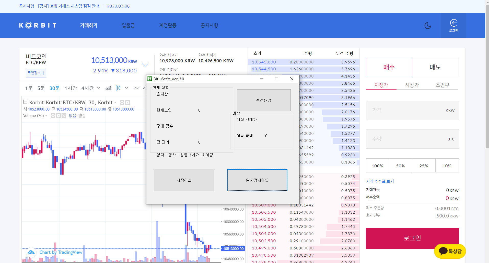
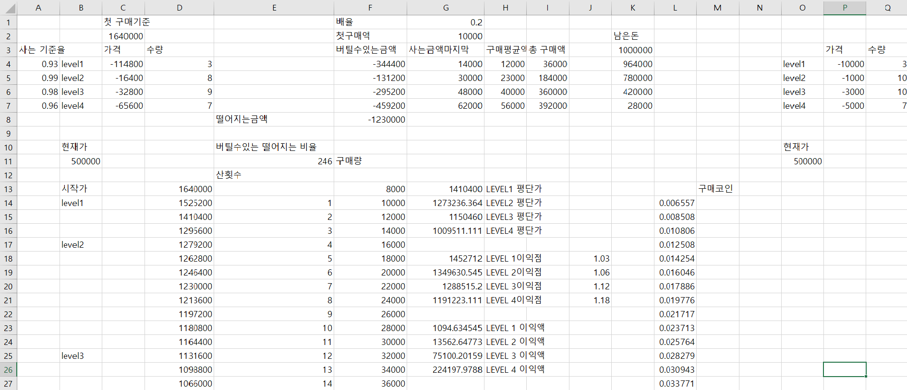

# bitcoin-trading-bot

💰 2017 Bitcoin Project using AutoHotKey

> `2017. 09. 01 ~ 2017. 11. 01`

## Team : bit-juseyo

- 강중석
- [김설호](https://github.com/seolhokim)

## Idea

> Bitcoin Trading Competition

- senior investment of \$3000
- eight teams participation

## Main Function

1. algorithm using gambler law
2. Real-time price change monitoring
3. Real-time automatic trading

## Used Stack

- [AutoHotKey](https://www.autohotkey.com/)
